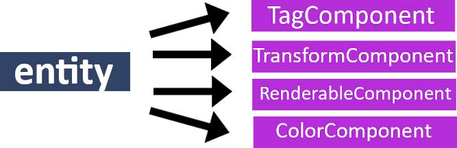
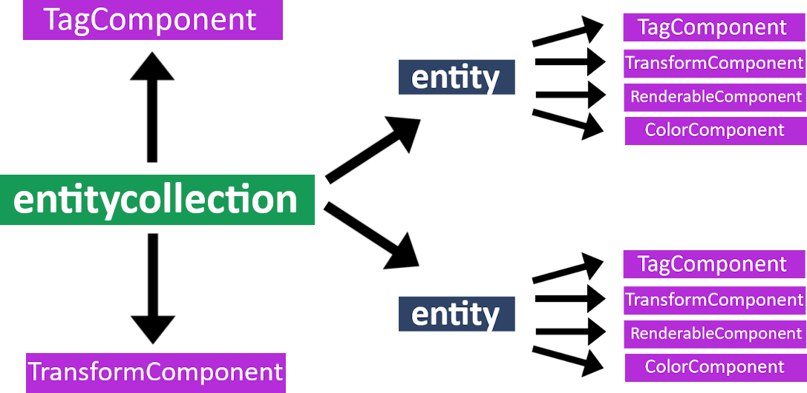
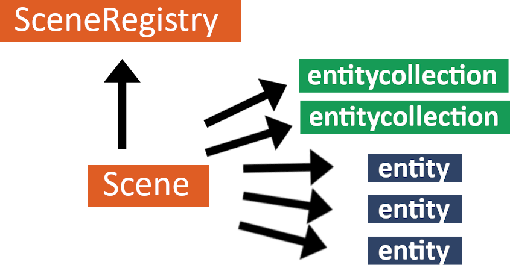
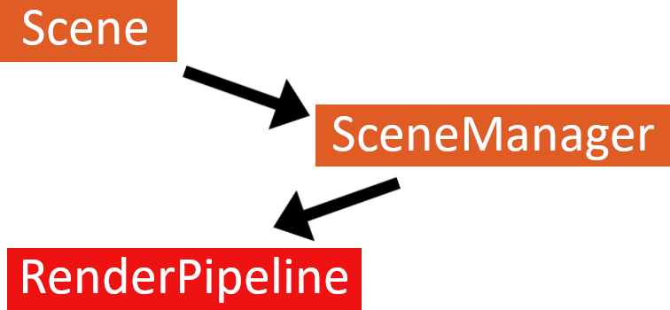
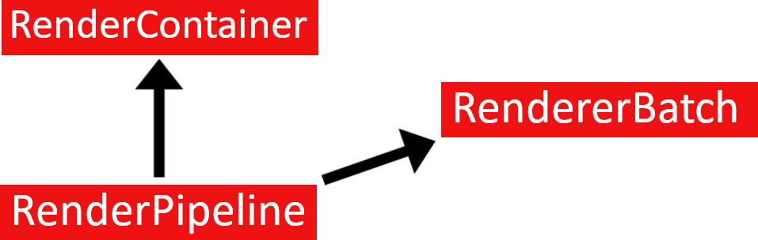

Architecture
============

.. seealso::

    This page describes the MAREngine's architecture. From this site you can learn how everything works.
    There are only the most important information, that you need to know for proper understanding MAREngine workflow.

Namespaces
----------

mar
~~~

**mar** is the main namespace for everything. mar brings together all the other namespaces that are responsible for specific engine elements, such as:

* Entity-Component-System (:ref:`mar::ecs<namespace_ecs>` )
* Graphics (:ref:`mar::graphics<namespace_graphics>` )
* Scripting Module for Python (:ref:`mar::scripting<namespace_scripting>` )
* GUI Editor (:ref:`mar::editor<namespace_editor>` )
* LayerStack (:ref:`mar::layers<namespace_layers>` )
* Window and Input (:ref:`mar::window<namespace_window>` )
* 3rd_party dependencies such as OpenGL, GLFW, Vulkan (:ref:`mar::platforms<namespace_platforms>` )
* Logging and debugging information (:ref:`mar::debug<namespace_debug>` )

General
-------

The most important concepts
~~~~~~~~~~~~~~~~~~~~~~~~~~~

* :ref:`Entity<class_Entity>`
* :ref:`EntityCollection<class_EntityCollection>`
* :ref:`Components<ecs_Components>`
* :ref:`Scene<class_Scene>`
* :ref:`SceneRegistry<class_SceneRegistry>`
* :ref:`SceneManager<class_SceneManager>`
* :ref:`RenderPipeline<class_RenderContainer>`
* :ref:`RenderPipeline<class_RenderPipeline>`
* :ref:`RendererBatch<class_RendererBatch>`

Architecture Overview
~~~~~~~~~~~~~~~~~~~~~

We have :ref:`Entity<class_Entity>`, a general purpose object to which we can attach some :ref:`Components<ecs_Components>` . In other words, entity is something
that lives during the render loop, we can see all entities in Scene Hierarchy Panel in GUI Editor.

Default components are always attached:

* :ref:`TagComponent<class_TagComponent>` - entity name in GUI Editor
* :ref:`TransformComponent<class_TransformComponent>` - entity transform, using this component we can adjust its position, rotation, etc. 

Other components  can be added to the :ref:`Entity<class_Entity>` with its member methods. But using only ``Tag`` and ``Transform`` we cannot render anything onto the screen. 
We have to add some renderable stuff, which in MAREngine is defined by :ref:`RenderableComponent<class_RenderableComponent>` . This component by default contains
emmpty vector of vertices and indices. We can fill this data with :ref:`MeshCreator<class_MeshCreator>` class. But it is not the end. For proper rendering 
we also need some material, currently MAREngine supports three components for that:

* :ref:`ColorComponent<class_ColorComponent>` - just a color
* :ref:`Texture2DComponent<class_Texture2DComponent>` - any image file ending with .jpg or .png
* :ref:`TextureCubemapComponent<class_TextureCubemapComponent>` -  directory which contains 6 images. 

.. attention::

     It can be rendered only if entity has :ref:`RenderableComponent<class_RenderableComponent>` and one of those three components above!

Another living structure defined in MAREngine is :ref:`EntityCollection<class_EntityCollection>` . As the name says it can possess some entities, in other words it is a container
for several entities. We can also attach some components to :ref:`EntityCollection<class_EntityCollection>`. Like in :ref:`Entity<class_Entity>` , 
 :ref:`TagComponent<class_TagComponent>` and :ref:`TransformComponent<class_TransformComponent>` are also added by default. More attention is required by TransformComponent  in EntityCollection.
All entities have parameters relative to that EntityCollection's transform parameters!

Ok, now we know that there are Entities and EntityCollections, but they can't be alone. Let's take a look at :ref:`Scene<class_Scene>` , which is a creator. One of its members,
:ref:`SceneRegistry<class_SceneRegistry>` is a base for all the information about the current scene. A SceneRegistry can store and manage entities (its unique IDs!). From Registry
we are able to see, if this entity is valid or not, if it has some component and do something with it. I like to say that, :ref:`Scene<class_Scene>` is some abstraction
for that SceneRegistry, as we don't want to use pure methods that sometimes are hard to read. We can say it is a maker for the whole game, becauce Scene with its 
member SceneRegistry has the power to create entities, destroy them and do some magical stuff.

.. attention::

    Generally, :ref:`Scene<class_Scene>` contains all the entities and collections.

Now we can take a look at how rendering works. :ref:`Scene<class_Scene>` has to have a manager or something simillar, Scene itself cannot update information about
entities, there must be some other way. For that reason we have :ref:`SceneManager<class_SceneManager>` , which can push data to :ref:`RenderPipeline<class_RenderPipeline>` ,
it can call ``update()`` method from :ref:`PythonScript<class_PythonScript>`. In general, it manages a :ref:`Scene<class_Scene>` .

:ref:`SceneManager<class_SceneManager>` has the ability to push :ref:`Entities<class_Entity>` and :ref:`EntityCollections<class_EntityCollection>` to
:ref:`RenderPipeline<class_RenderPipeline>` . Then RenderPipeline is reponsible for this data. It prepares the whole stuff for rendering, parses and then pushes it 
to :ref:`RenderContainers<class_RenderContainer>` . Prepared data for rendering is stored in containers. When there is need for draw call, RenderPipeline is returning
all the stored containers and :ref:`RendererBatch<class_RendererBatch>` is iterating over them. During every iteration stuff is being drawn onto the screen.

This is it! General overview of the MAREngine's core.