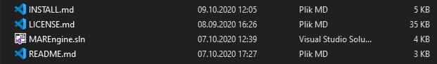
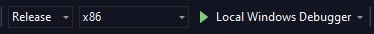
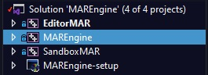
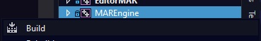
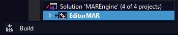
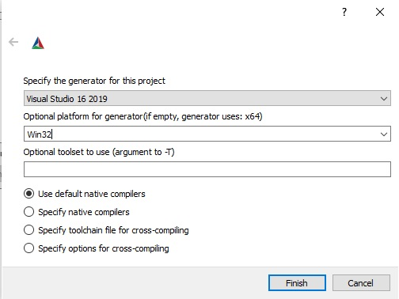
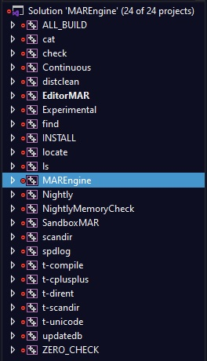

Compiling from sources
======================

The version, currently the only one available, is prepared for Windows 10 32-bit. OpenGL libraries (32-bit versions) are downloaded and added by default to linker, so you do not have to download them again. Only dependency is actually this repository.

Dependencies
------------

The most needed application for MAREngine on Windows is Visual Studio 2019. Through it I am able to compile sources correctly. CMake is also added for future integration with Linux Operating Systems.

Some requirements are fullfiled from public repositories, but some of them are just added.

Repositories, that need to be cloned (if clone MAREngine with --recurse-submodules you will have them automatically):

* `ImGuiColorTextEdit <https://github.com/BalazsJako/ImGuiColorTextEdit/tree/master>`__
* `ImGui-Addons <https://github.com/gallickgunner/ImGui-Addons/tree/master>`__
* `ImGuizmo <https://github.com/CedricGuillemet/ImGuizmo/tree/master>`__
* `MARMaths <https://github.com/Mregussek/MARMaths/tree/master>`__
* `OBJ-Loader <https://github.com/Mregussek/OBJ-Loader/tree/master>`__
* `imgui (docking branch) <https://github.com/ocornut/imgui/tree/docking>`__
* `pybind11 <https://github.com/pybind/pybind11/tree/master>`__
* `spdlog <https://github.com/gabime/spdlog/tree/master>`__

Repositories, that are added already with the MAREngine:

- glew
- glfw3
- entt (because it is single-include, we don't need the whole repository)
- python3.8.5
- stb_image

Installation
------------

Please, do not download repository as a .zip file, because you will not fullfil dependencies such as submodules above!

Windows
-------

#1 The easiest way
~~~~~~~~~~~~~~~~~~

1. Clone repository

.. code-block:: bash
    
    git clone --recurse-submodules https://github.com/mregussek/MAREngine.git


2. Open MAREngine.sln (located in main directory).


    

3. Make sure, that selected target is x86 (no x64!)




4. Firstly you will have to build *MAREngine* in order to create static library.







5. If library is compiled succesfully you should find ${SolutionDir}/bin/Release/Engine/MAREngine.lib file. Now you can compile either **EditorMAR** or **SandboxMAR**. Choose, which one you want to use with *Build* option. Also make sure, that selected project should be set as startup (marked with bold font).




6. Have fun! ;)

#2 CMake on Windows
~~~~~~~~~~~~~~~~~~~

1. Clone repository (with submodules, cause I use ImGui, spdlog, serialport and MARMaths from its own sources!)

```
git clone --recurse-submodules https://github.com/mregussek/MAREngine.git
```

2. Open CMake (CMake-GUI in my case)
3. Select proper paths!

- Where is the source code: Here please select path, where you cloned repository!
- Where to build binaries: Please select path to repository with /build directory!

Examples:

- Where is the source code: *C:/Path/to/MAREngine*
- Where to build binaries: *C:/Path/to/MAREngine/build*

4. Press **Generate** button!

.. image:: img/cmake_generate.jpg
    :width: 813
    :height: 356
    :align: center


5. New window will be opened. Here make sure, that you choose generator for Win32!)




6. Press **Finish**. CMake will generate all needed files.
7. Select **Open Project** button. You will be able to compile project.
8. Firstly you have to build *MAREngine* in order to create static library.




9. Secondly you have to build **EditorMAR** or **SandboxMAR**. Make sure, that selected project should be set as startup (marked with bold font).

10. Copy *DefaultProject*, *resources* directories from EditorMAR to *C:/Path/to/MAREngine/build*. Also copy desktop.ini, imgui.ini and python38 to *C:/Path/to/MAREngine/build*.